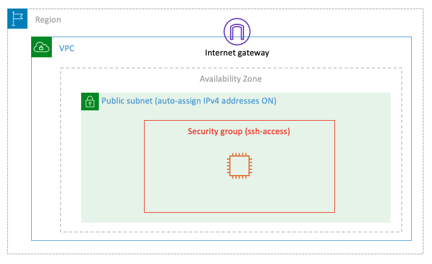
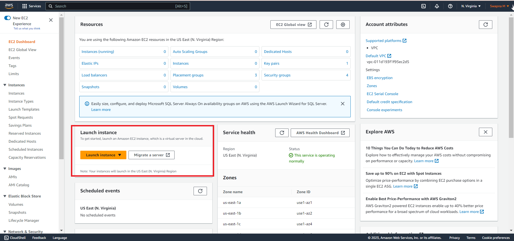

# Lab-01

## A Single EC2 Instance

## Goal
This lab's objective is to deploy a single EC2 instance on a public subnet that can be accessed remotely using Secure Shell (SSH) from anywhere in the world. [Here](../images/EC2.png) is a mind map of EC2.

## Architecture Diagram

## Overview

In order to achieve the goal of this lab, you will have to go through the following steps:

1. Choose the operating system by selecting the [Amazon Machine Image (AMI)](https://docs.aws.amazon.com/AWSEC2/latest/UserGuide/AMIs.html).
2. Define the virtual hardware configuration by choosing an [Instance Type](https://docs.aws.amazon.com/AWSEC2/latest/UserGuide/instance-types.html).
3. Review the network settings.
4. Review the storage settings.
5. Create tags (optional).
6. Configure the [Security Group](https://docs.aws.amazon.com/vpc/latest/userguide/VPC_SecurityGroups.html) rules (firewall).
7. Launch the instance (choosing or creating an [EC2 key pair](https://docs.aws.amazon.com/AWSEC2/latest/UserGuide/ec2-key-pairs.html)).

Let's begin!!! Go to [AWS Console](https://console.aws.amazon.com/) and login with your credentials. Click on Services at the top left, then choose EC2 in the Compute section.

### Step 1 - Choose the AMI
In the EC2 service menu, click on *Launch instance* and select *Launch Instance*.  

Select *Amazon Linux 2 AMI*. An AMI is a template that contains the software configuration (operating system, application server, and applications) required to launch your instance. In this first lab, we will stick to the x86 architecture.
