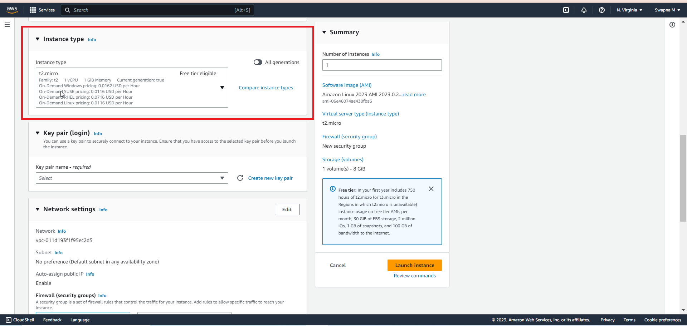

# Lab-01

## A Single EC2 Instance

## Goal
This lab's objective is to deploy a single EC2 instance on a public subnet that can be accessed remotely using Secure Shell (SSH) from anywhere in the world. [Here](../images/EC2.png) is a mind map of EC2.

## Architecture Diagram

## Overview

In order to achieve the goal of this lab, you will have to go through the following steps:

1. Choose the operating system by selecting the [Amazon Machine Image (AMI)](https://docs.aws.amazon.com/AWSEC2/latest/UserGuide/AMIs.html).
2. Define the virtual hardware configuration by choosing an [Instance Type](https://docs.aws.amazon.com/AWSEC2/latest/UserGuide/instance-types.html).
3. Review the network settings.
4. Review the storage settings.
5. Create tags (optional).
6. Configure the [Security Group](https://docs.aws.amazon.com/vpc/latest/userguide/VPC_SecurityGroups.html) rules (firewall).
7. Launch the instance (choosing or creating an [EC2 key pair](https://docs.aws.amazon.com/AWSEC2/latest/UserGuide/ec2-key-pairs.html)).

Let's begin!!! Go to [AWS Console](https://console.aws.amazon.com/) and login with your credentials. Click on Services at the top left, then choose EC2 in the Compute section.

### Step 0 - Tags
_Tags_ is a way to add textual metadata to AWS Resources to help you manage your cloud environment. For now, you can skip this step.

Go on to _Next: Configure Security Group_.

### Step 1 - Choose the AMI
In the EC2 service menu, click on *Launch instance* and select *Launch Instance*.  

Select *Amazon Linux 2 AMI*. An AMI is a template that contains the software configuration (operating system, application server, and applications) required to launch your instance. In this first lab, we will stick to the x86 architecture.

### Step 2 - Define the Instance Type
The instance type defines the CPU and memory capacity. It also specifies the storage architecture that the instance will suppport, along with network perfomance available. You can use the suggested free-tier eligible instance type, and then go  to _ Configure Instance Details_.

### Step 3 - Network Settings
Make sure you select the public default subnet and that the *Auto-assign Public IP* setting is enabled for that subnet. You may leave all the other settings with their default values.

_Go to add storage_.

### Step 4 - Storage Settings
You can accept the default settings which creates an EBS root volume.

Go to _Add Tags_.

