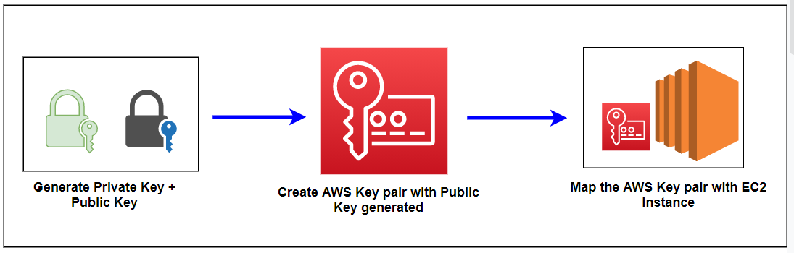
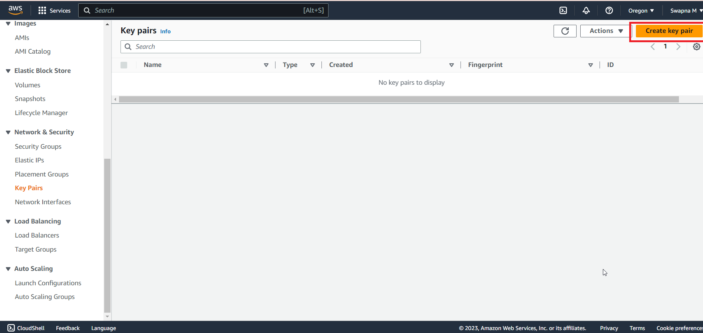
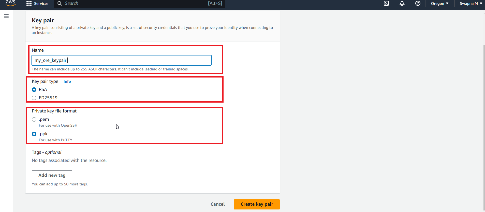
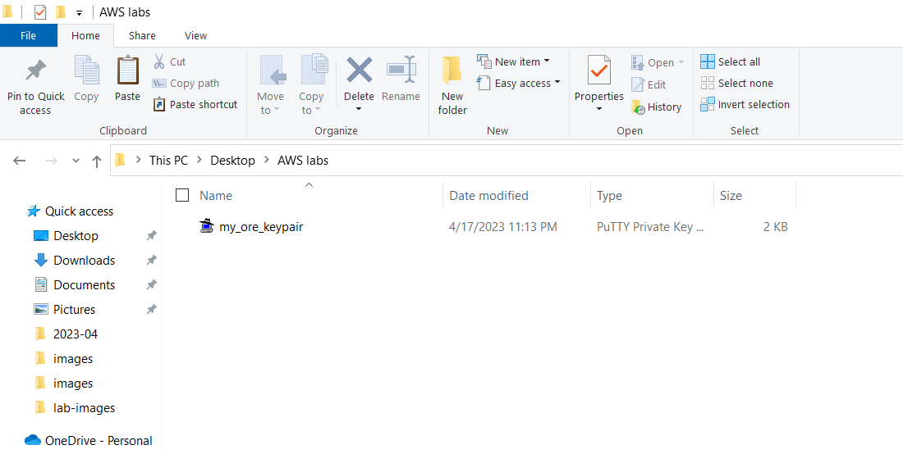
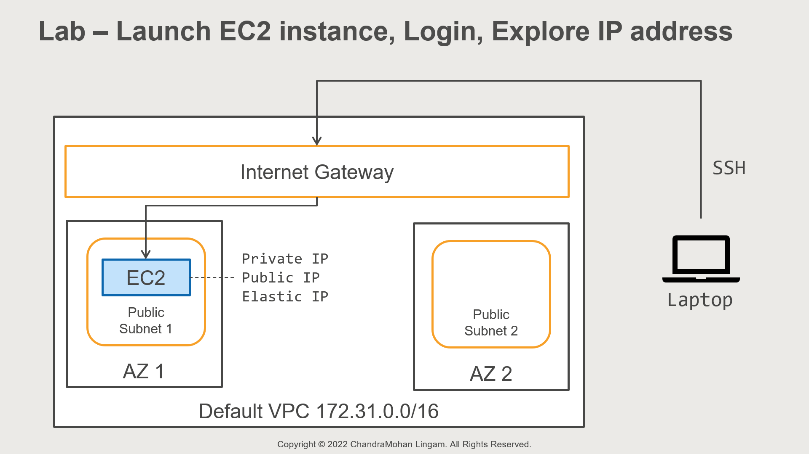
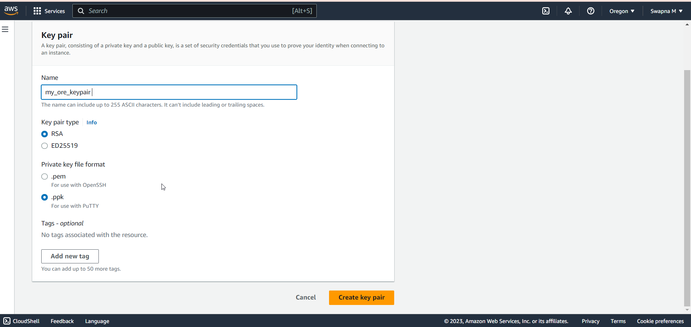
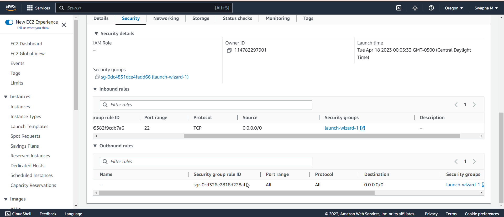
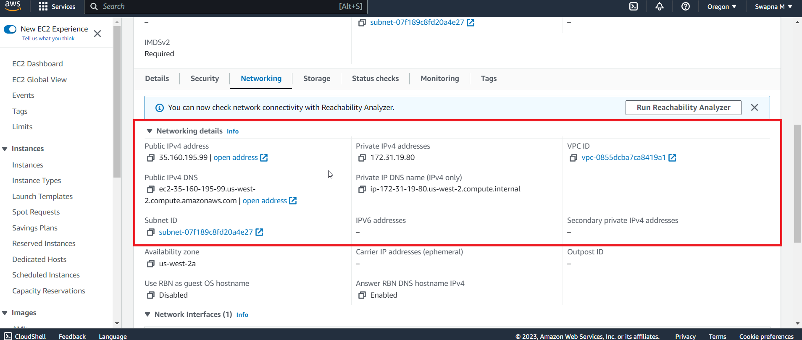

# Lab-02

## How to create Keypair for EC2

In this lab, we are going to create a keypair required for logging into EC2 instances

Amazon Linux EC2 instances do not use user id and passwords as they are generally easy to guess

Instead, they are protected using keypairs that you specify when launching the instance

Keypair consists of a public key, which is like a user id and a private key, which is similar to a password

So, when launching an instance, we need to specify the public key

And when you log in, we need to present the matching private key and EC2 logs 

## Architecture Diagram

## Steps - Keypair

1. Login to AWS console using your myadmin user

2. Open EC2 service console

3. Make sure you don’t have any popup blockers for this site

4. Ensure you are in the correct region – I am using US West Oregon. The keypair that we create are region-specific

5. Select Key Pairs from the left navigation pane

6. You can create a new one or import your existing key

7. Let’s quickly look at the import option

8. Action and Import Key pair

a. You need to provide only the public key of your existing key pair

b. This option is useful if you want to use the same key across different regions

c. You can use tools like openssh or putty to generate your own keys

https://www.ssh.com/academy/ssh/keygen

9. The other option is we can ask AWS to create one for us

10. Create Key Pair

a. Name: my_ore_keypair

I generally specify the username followed by region

b. KeyPairType: RSA

c. Private Key Format: Choose PPK format if you use a windows laptop. This format is compatible with the Putty tool that we will use on Windows. If you are on Mac or Linux laptop, you can select the PEM format. This format is compatible with the openssh tool

d. I will select PPK format as I primarily work on Windows Laptop

e. Using Putty tool, it is also possible to convert one format to another https://aws.amazon.com/premiumsupport/knowledge-center/ec2-ppk-pem-conversion/

11. Create Keypair

12. The page will automatically download the keypair to your machine. This is the only opportunity to download the keypair. EC2 will store only the corresponding public key in the console

13. Keep this file in a safe location. Treat it like a user id and password. [For example, C:\AWSTraining\Labs]

14. We can now use the key pair to log in to EC2 instances

15. If you are on Mac, Lab - Connect to your EC2 Linux from Mac lecture shows you how to connect to the EC2 instance

Steps – Putty Tool
1. If you are on windows, please install the Putty Tool

2. Go to https://www.putty.org/

3. Download Putty

4. Download 64-bit x86 MSI

5. Install the app

##  Launch EC2 instance, Login, Explore Private, Public, and Elastic IP

## Goal 
In this lab, we will launch an EC2 instance in a public subnet of the default VPC. We are then going to log in to the instance using SSH. Finally, we will also explore private, public, and Elastic IP address that you can assign to an instance

## Architecture Diagram

## Overview

Steps to launch

1. From AWS, open EC2 console

2. Make sure you are in the correct region

3. We will use the default VPC and Keypair that we created earlier

4. Select Instances in the left navigation pane

5. And launch instances

6. Name the instance: LinuxServer

7. For Amazon Machine Image

a. Choose Amazon Linux AMI

b. From AMI drop down: Select Amazon Linux 2

8. For instance type, use t2.micro or t3.micro – these are free-tier eligible instances. If you don’t see t2.micro, simply choose t3.micro

9. Key pair: Now, we need to specify the Keypair that can Login to the machine

a. If you don’t specify a keypair, you will not be able to Login to the machine

b. So, choose the Keypair that we created earlier

10. Network settings: we can provide VPC information

a. Edit

b. VPC: Select default VPC

c. Subnet: let’s pick the subnet in Availability Zone 2A (scroll the list and find the Availability Zone ending with 2A)

d. Auto-assign Public IP: Enable

e. Let’s create a new Security Group – we are going to allow SSH access so that we can log in to the machine

f. Security group name: SSHAccess

g. Type: SSH

h. Protocol: TCP

i. Port: 22

j. Source type: Select Anywhere. All 0s mean any IPv4 address. The ::/0 refers to any IPv6 address. So, anyone can connect to the SSH port.

k. Usually, you would want to limit SSH access to a specific IP address. For example, I can limit access only from my IP address. For this lab, let’s use it anywhere

11. For storage, we will use the default storage of 8GB

a. Go to the next page

12. Launch the Instance

13. Click on Instances

14. We can see our LinuxServer and wait until the instance state changes to Running

15. Click on the Instances Id link to open the detail page

16. And we can see the details

a. This server has a public IP address assigned

b. And it also has a private IP address

c. Scroll down and view the Security tab

d. We can see that under security group inbound rules, SSH Access is allowed on port 22 from anywhere

e. Let’s copy the public IP (scroll up)

