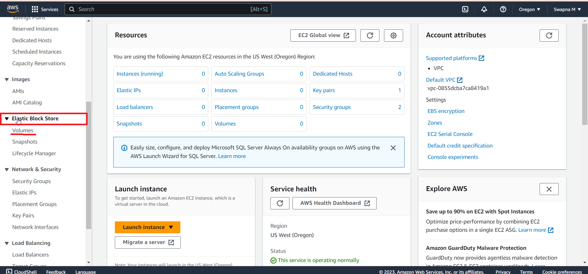
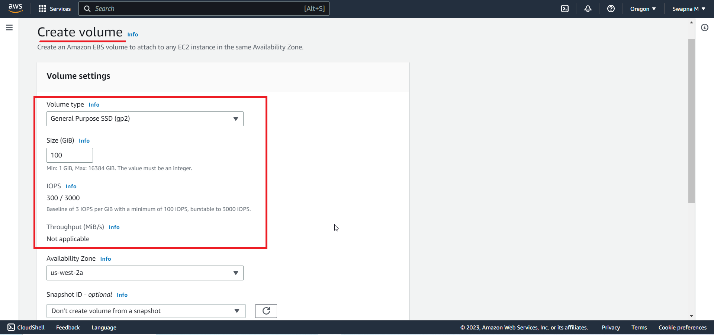
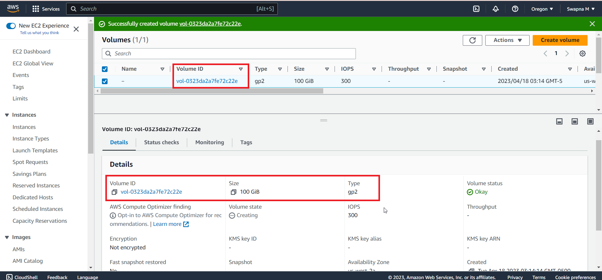
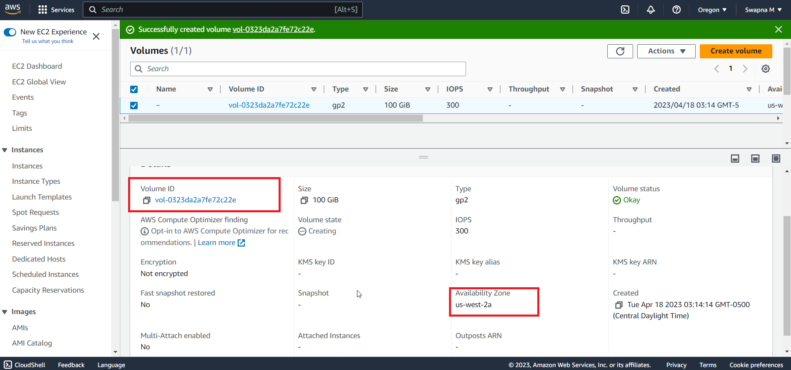
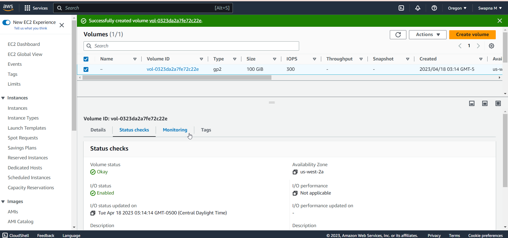
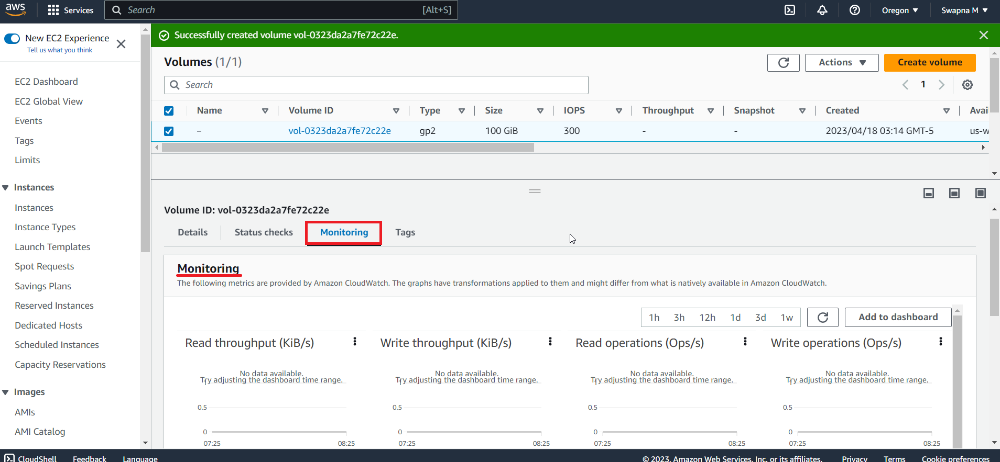
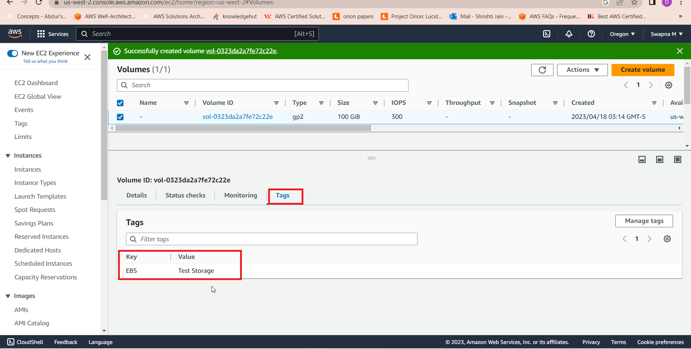

# Lab-03

## EBS Elastic Block Storage 

• EBS is a managed block storage service
• Storage volume is outside of host computer – Long term persistence
• EC2 instance use EBS storage volume as a block device
• You need to pay for allocated EBS storage

## EC2 Benefits with EBS
• Stop-Start EC2 Instance
• Persist EBS volumes for terminated instances
• Detach and attach volume to a different instance in the 
same Availability zone
• Built-in Snapshot Capability for incremental backup to 
S3
• Create Amazon Machine Image (AMI) from Snapshots to 
launch new EC2 instance
 
## Step 1 

Login to your AWS console, on the top right of the screen, navigate to Service > Compute > EC2

## Step 2 

You are on the EC2 Dashboard, on the left navigation pane, scroll down to** Elastic Block Store*, click on **Volumes*.

## Step 3

On the volumes dashboard, click on Create Volume

## Step 4 Volume Settings

On Create Volumes, for volume setting use these values:
Volume type: General Purpose SSD (gp2)
Size GB: 4
Availability Zone: your choice for this exercise.

## Step 5 Tags

Use these values:
Key: name
Value: Test Storage

Click on Create Volume

## Step 6 Volume Dashboard

This dashboard displays a list of created volumes in this availability zone (us-west-2a), with the volume state.

Click on the newly created volume ID

## Step 7 Volume Status Checks

scroll down to status check, displayed is the Volume status, I/O status, Availability Zone, and some other relevant information.

## Step 8 Monitoring

Click on monitoring, displayed is an extensive metrics, and applied graph transformations, provided, by Cloud Watch.

## Step 9 Tags

Displayed, Key: EBS | value : Test Storage

