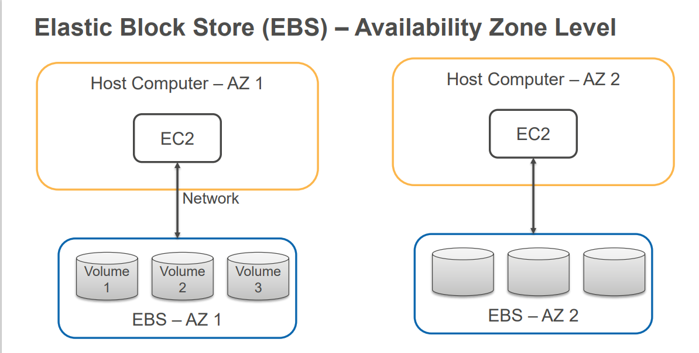

# Lab-03

## EBS Elastic Block Storage 

• EBS is a managed block storage service
• Storage volume is outside of host computer – Long term persistence
• EC2 instance use EBS storage volume as a block device
• You need to pay for allocated EBS storage

## EC2 Benefits with EBS
• Stop-Start EC2 Instance
• Persist EBS volumes for terminated instances
• Detach and attach volume to a different instance in the 
same Availability zone
• Built-in Snapshot Capability for incremental backup to 
S3
• Create Amazon Machine Image (AMI) from Snapshots to 
launch new EC2 instance
 
